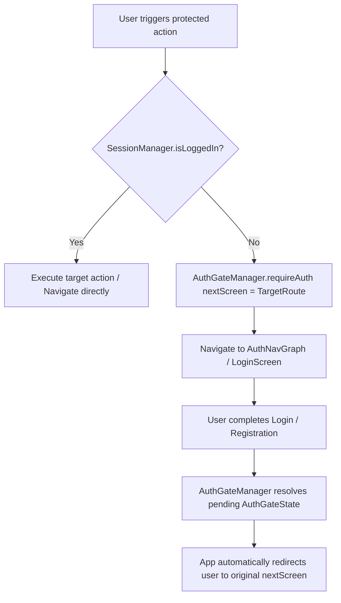

<p align="center">
  
</p>

<h1 align="center">Baltazar Android Application</h1>

<p align="center">
  A robust, production-ready, and highly scalable multi-module Android application built with <b>Kotlin</b> and <b>Jetpack Compose</b>. Baltazar integrates a full ecosystem of services—including Food delivery, Hotel booking, Travel tours, Rent-a-car, and Taxi ride-hailing—into a single unified mobile experience.
</p>

<p align="center">
  
  
  
  
  
</p>

<p align="center">
  
  
  
  
  
  
</p>

---

## 🏗️ Architecture & Module Partitioning (Bölgü Sistemi)

The project strictly follows a **Feature-based Multi-Module Clean Architecture**. This ensures complete layer isolation, high maintainability, atomic testability, and parallel compile speeds.

```text
root/
├── app/                        # Main entry point (Global NavHost, MainActivity, Hilt App)
├── core/                       # Shared foundational library module (:core)
│   ├── components/             # Reusable UI atoms (CustomTextField, CustomAppBar, CustomAlertDialog)
│   ├── constants/              # Centralized Design Tokens (Paddings, Spaces, BorderRadiuses, IconSizes)
│   ├── enums/                  # Global domain enums (Language, Region, ServiceType, UserRole)
│   ├── managers/               # Centralized managers (SessionManager, AuthGateManager, CacheManager)
│   ├── navigation/             # Type-safe Navigation route definitions & screen contracts
│   └── theme/                  # Material3 Theme, Palette, Typography, and Shapes
│
└── feature/                    # Autonomous Feature Modules
    ├── auth/                   # Login, Register, Verification, Onboarding & Auth Gate flow
    ├── explore/                # Home discovery, global search & category navigation
    ├── food/                   # Food menu, service detail, company page & reviews
    ├── hotel/                  # Hotel discovery, room selection & booking flow
    ├── travel/                 # Tour packages, itineraries & destination booking
    ├── rentacar/               # Vehicle listings, specifications & rental checkout
    ├── taxi/                   # Ride hailing, real-time map tracking & fare calculation
    ├── profile/                # User profile, personal information, driver license & passport settings
    └── order/                  # Centralized Checkout flow (Map delivery selection, Payment, Confirmation)
```

### 🧱 Modular Clean Architecture Rules
Every feature module (e.g., `feature/order`, `feature/auth`) strictly enforces four internal packages:

```text
feature/<name>/src/main/java/com/example/baltazar/feature/<name>/
├── core/                  # Module-specific utilities, DI modules (Network & Repository), Navigation graphs
│   ├── di/                # Independent AuthNetworkModule / AuthRepositoryModule
│   ├── mapper/            # Custom exception and DTO mappers
│   └── navigation/        # Sub-navigation graphs
├── data/                  # Data Layer
│   ├── datasources/       # Remote API services and Retrofit endpoints
│   ├── model/             # Request & Response DTO models (request/, response/)
│   └── repository/        # Repository implementations
├── domain/                # Domain Layer (Pure Kotlin, zero Android dependencies)
│   ├── model/             # Domain entities (e.g. PaymentCard, OrderItem)
│   └── repository/        # Repository Interfaces (e.g. IOrderRepository)
└── ui/                    # Presentation Layer
    ├── components/        # Atomic, pure UI components (No ViewModel dependencies)
    └── screens/           # Composables & ViewModels (State orchestration)
```

> 📌 **Rule on Shared Models**: If a model (e.g., `User` or `SessionToken`) is shared across more than one feature module, it is promoted to `:core:domain`. Feature modules never depend directly on each other; they only depend on `:core`.

---

## 🔒 Centralized Auth Gate & Target Screen Redirection (`AuthGateManager`)

To provide a seamless user experience, guest users are allowed to browse products, hotels, and services freely. However, when an unauthenticated user attempts to perform a protected action (e.g., placing an order, writing a review, or opening profile settings), the application intercepts the action via **`AuthGateManager`**.

### 🔄 How `AuthGateManager` Works



1. **Gate Trigger**: When a composable or ViewModel calls `authGateManager.requireAuth(nextScreen = OrderSummaryRoute)`, the manager checks the user session via `SessionManager`.
2. **Pending Route Preservation**: If the user is unauthenticated, `AuthGateManager` emits an `AuthGateState.Required(nextScreen)` event and saves the target destination route.
3. **Seamless Redirection**: The global `NavHost` captures the event and routes the user to `AuthNavGraph`. Upon successful authentication, `AuthGateManager.onAuthSuccess()` triggers navigation directly to the original target `nextScreen` (e.g. `OrderSummaryRoute`), bypassing unnecessary steps.

---

## 💳 Payment System & Component Decomposition (`feature/order`)

The payment architecture in `feature/order` handles secure payment processing, saved cards selection, tokenization of new credit cards, and error handling via `Baltazar-Payment-Backend`.

### 🧩 `PaymentScreen` Component Decomposition
To maintain readability and clean separation of concerns, `PaymentScreen.kt` acts strictly as an **Orchestrator**. It delegates UI rendering to isolated, pure Composables inside `payment/components/`:

```text
payment/
├── PaymentScreen.kt                  # UI Orchestrator (~140 lines)
└── components/
    ├── SavedCardsSection.kt          # List of user's saved payment methods
    ├── SavedCardItem.kt             # Individual atomic card item with radio selection
    ├── AddCardButton.kt             # Styled button triggering new card bottom sheet
    ├── OrderSummaryCard.kt          # Dynamic base price & total price breakdown
    ├── PaymentBottomBar.kt          # Bottom container with progress indicator & pay button
    ├── PaymentLoading.kt            # Loading indicator during initial data fetch
    ├── AddCardBottomSheet.kt        # Card tokenization form (Card Number, Expiry, CVV)
    └── PaymentErrorBottomSheet.kt   # Error modal handling declined cards with retry logic
```

### ⚡ Clean Component Coupling Principle
UI components under `components/` **never accept `PaymentViewModel` directly**. Instead, they accept primitive values, state data objects, and emit event callbacks:

```kotlin
// ❌ Bad: Component bound to ViewModel (Reduces reusability & testability)
SavedCardsSection(viewModel = viewModel)

// ✅ Good: Pure component accepting clean parameters & returning callbacks
SavedCardsSection(
    cards = state.savedCards,
    selectedCardId = state.selectedCardId,
    onCardSelected = viewModel::selectCard
)
```

---

## ⚡ Asynchronous Operations & Exception Handling

1. **ViewModel Coroutine Scope**: All network and I/O calls in ViewModels strictly specify `Dispatchers.IO`:
   ```kotlin
   viewModelScope.launch(Dispatchers.IO) {
       val result = orderRepository.processPayment(request)
       // Update state on Main thread via StateFlow
   }
   ```
2. **Custom Exception Mapping**: Network errors and Retrofit `HttpException` instances are never leaked raw to the UI. They are transformed into domain-specific exceptions via custom mappers (e.g. `ValidationErrorMapper`), and friendly error messages are displayed via Snackbar or BottomSheets.

---

## 🎨 Design System & UI Token Compliance

All UI components adhere strictly to the project design tokens defined in `:core:constants`:
- **Spacings**: `Spaces.ExtraMini`, `Spaces.Small`, `Spaces.Medium`, `Spaces.Large`, `Spaces.Huge`
- **Paddings**: `Paddings.Mini`, `Paddings.Small`, `Paddings.Medium`, `Paddings.Large`, `Paddings.Massive`
- **Radiuses**: `BorderRadiuses.Small`, `BorderRadiuses.Medium`, `BorderRadiuses.Large`, `BorderRadiuses.Huge`
- **Icon Sizes**: `IconSizes.Small`, `IconSizes.Medium`, `IconSizes.Large`, `IconSizes.Max`
- **Typography & Palette**: Exclusively derived from `MaterialTheme.typography` and `MaterialTheme.colorScheme`.

---

## 🌐 Backend Microservices Integration

The application integrates with two primary backends:
- **[Baltazar-Backend](https://github.com/MegrurNiftiyev/Baltazar-Backend)**: Primary REST API powering authentication, catalog exploration, reviews, and user management.
- **[Baltazar-Payment-Backend](https://github.com/MegrurNiftiyev/Baltazar-Payment-Backend)**: Dedicated microservice handling tokenization, card storage, and payment gateway authorizations.

---

## 🛠️ Getting Started

1. Clone the repository:
   ```bash
   git clone https://github.com/MegrurNiftiyev/Baltazar-Mobile.git
   ```
2. Open the project in **Android Studio Ladybug** (or newer).
3. Sync Gradle dependencies and run the `:app` configuration on an Android Emulator or physical device.

---

## 📄 License

This project is licensed under the **MIT License**.
